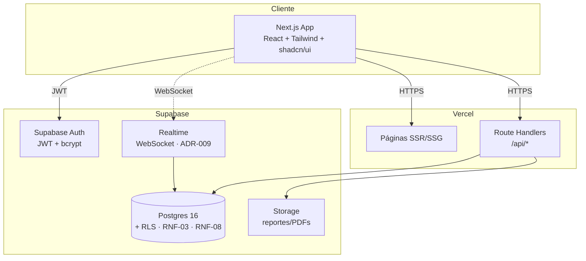
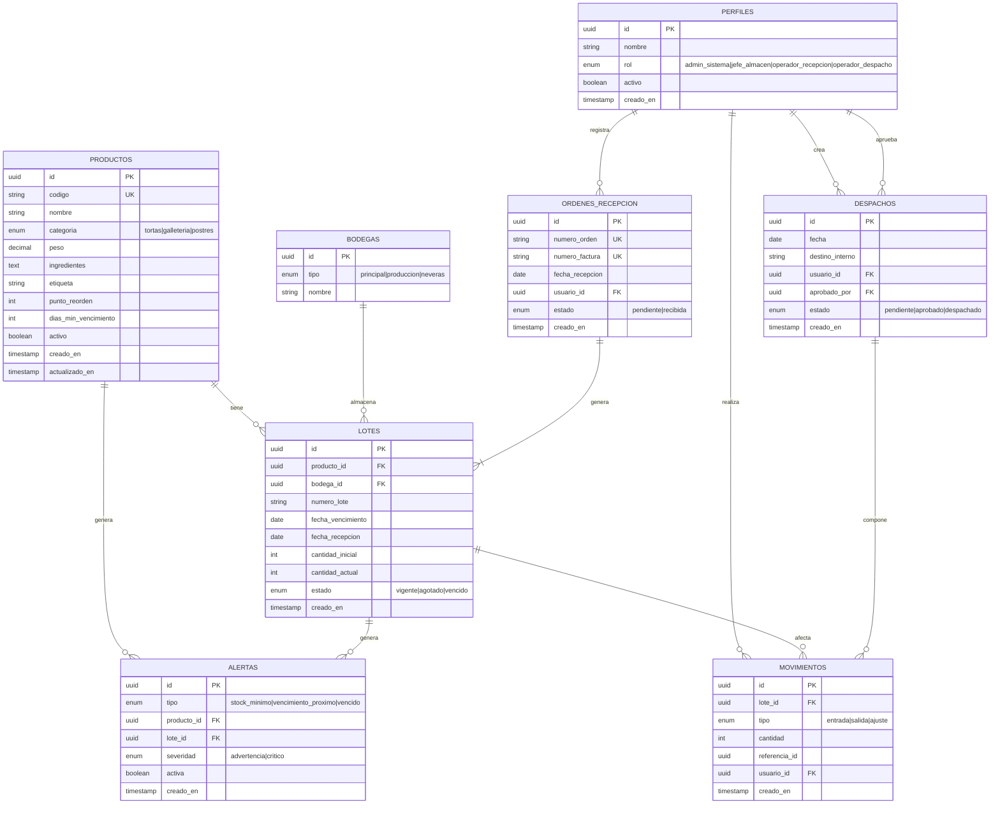
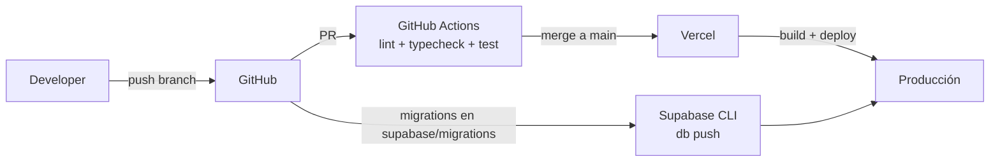

# Sistema de Gestión de Inventario y Logística (SGIL)

**Documento Técnico y Guía de Desarrollo**
**Proyecto Nuclear 3 — Corporación Universitaria Alexander von Humboldt**
**Ingeniería de Software · Semestre I-2026**

> Este documento complementa la **Especificación de Requisitos de Software (ERS)** del SGIL. La ERS es la **fuente de verdad contractual** del proyecto; este documento describe cómo se construye la solución que la satisface (arquitectura, stack, fases, despliegue).
>
> **En caso de conflicto entre este documento y la ERS, prevalece la ERS. Si alguno contradice la guía del proyecto nuclear, prevalece la guía.**

---

## Tabla de contenidos

1. [Resumen ejecutivo](#1-resumen-ejecutivo)
2. [Alcance funcional](#2-alcance-funcional)
3. [Stack tecnológico](#3-stack-tecnológico)
4. [Arquitectura del sistema](#4-arquitectura-del-sistema)
5. [Modelo de datos](#5-modelo-de-datos)
6. [Seguridad y control de acceso](#6-seguridad-y-control-de-acceso)
7. [Tiempo real](#7-tiempo-real)
8. [Plan de desarrollo por cortes](#8-plan-de-desarrollo-por-cortes)
9. [Estrategia de pruebas](#9-estrategia-de-pruebas)
10. [Despliegue](#10-despliegue)
11. [Observabilidad y operación](#11-observabilidad-y-operación)
12. [Riesgos y mitigaciones](#12-riesgos-y-mitigaciones)
13. [Pendientes con Ingeniería Industrial](#13-pendientes-con-ingeniería-industrial)

---

## 1. Resumen ejecutivo

El SGIL es una aplicación web que digitaliza la gestión de inventario, recepción de mercancía, despacho interno y generación de indicadores para un centro de distribución de productos de pastelería en el Quindío.

**Objetivos del sistema:**

- Reemplazar los procesos manuales de inventario (actualmente en Excel) por un registro digital trazable.
- Controlar stock por **lote** con política **FEFO** (First Expired, First Out), aplicada tanto en despachos como en la visualización de lotes (RF-09).
- Generar alertas automáticas de stock mínimo y vencimiento próximo en tiempo real.
- Ofrecer un dashboard de KPIs operativos y exportación de reportes en Excel y PDF.

**Decisión técnica consolidada:** la solución se construye como una app web full-stack con **Next.js 15 + TypeScript** en el frontend, **Supabase** (Postgres + Auth + Realtime + RLS) como backend-as-a-service, y despliegue en **Vercel + Supabase Cloud**. Las decisiones arquitectónicas están documentadas en `docs/ADR.md` y sus tradeoffs en `docs/tradeoffs.md`.

---

## 2. Alcance funcional

### 2.1 Incluido en el MVP

| Módulo | Cubre |
|---|---|
| Autenticación | Login con email/contraseña, JWT, control por rol (RF-00, RF-01, RF-02, RF-03) |
| Productos | Catálogo con categoría (enum), punto de reorden y días mínimos de vencimiento (RF-04 a RF-07) |
| Lotes | Trazabilidad por lote con fecha de vencimiento, bodega y política FEFO en visualización (RF-08, RF-09) |
| Recepción | Registro de órdenes de recepción con o sin orden de compra previa (RF-10, RF-11) |
| Despacho interno | Salida de productos a destino interno con FEFO automático y aprobación (RF-12, RF-13) |
| Alertas | Stock mínimo, vencimiento próximo y despachos pendientes en tiempo real (RF-14 a RF-16) |
| Indicadores | Dashboard KPI con cuatro métricas y exportación Excel/PDF (RF-17, RF-18) |
| API documentada | Swagger UI para todos los endpoints (RF-19) |

### 2.2 Fuera de alcance

- Punto de venta y despacho a clientes externos.
- Gestión de proveedores como entidad (no se registra proveedor por producto).
- Nómina, contabilidad y procesos productivos.
- Aplicación móvil nativa.
- Picking modelado como proceso separado (la selección de lote la hace FEFO automáticamente).

### 2.3 Roles del sistema

Los cuatro roles están definidos por la guía del Proyecto Nuclear. Sus valores en la base de datos son:

| Rol | Valor BD (`rol_usuario`) | Permisos clave |
|---|---|---|
| Administrador del sistema | `admin_sistema` | Acceso total + gestión de usuarios (crear, activar, desactivar, asignar rol) |
| Jefe de almacén | `jefe_almacen` | Acceso operativo total + aprobación de despachos + dashboard KPI |
| Operador de recepción | `operador_recepcion` | Crear/consultar órdenes de recepción, registrar lotes, consultar inventario |
| Operador de despacho | `operador_despacho` | Crear/consultar despachos (pendientes de aprobación), consultar inventario |

---

## 3. Stack tecnológico

### 3.1 Decisión de stack

| Capa | Tecnología | Razón |
|---|---|---|
| Framework | Next.js 15 (App Router) + TypeScript | SSR, rutas API integradas, tipado estricto (ADR-006) |
| UI | Tailwind CSS + shadcn/ui | Componentes accesibles, sin dependencia de design system pesado |
| Estado servidor | TanStack Query | Cache, revalidación y sincronización con Supabase |
| Backend | Supabase (Postgres 16) | BD relacional gestionada + Auth + Realtime + RLS de fábrica (ADR-007) |
| Auth | Supabase Auth (JWT) | Cumple RF-01, RF-02, RF-03 sin código adicional; bcrypt gestionado (ADR-003) |
| Tiempo real | Supabase Realtime (Postgres Changes) | WebSockets sobre cambios de tabla, sin servidor propio (ADR-009) |
| Validación | Zod | Esquemas compartidos cliente/servidor |
| Reportes | ExcelJS + jsPDF | Generación Excel editable (RF-18) y PDF de solo lectura (ADR-005) |
| Pruebas | Vitest + Playwright | Unitarias + e2e (cobertura ≥ 70%, RNF-06) |
| CI/CD | GitHub Actions + Vercel | Despliegue automático en push a `main` |
| Gestor de paquetes | pnpm | Velocidad y consistencia de lockfile |

### 3.2 Justificación del cambio respecto al documento original

El documento `PROYECTO_NUCLEAR_V` proponía **Rust + Axum + SQLx + Docker + Nginx + VPS**. Se reemplaza por **Next.js + Supabase** por las siguientes razones:

- **Velocidad de desarrollo:** el plazo académico (21 abril – 26 junio 2026) son ~9 semanas para tres cortes. Rust tiene curva de aprendizaje y verbosidad que penalizan el MVP.
- **Realtime nativo:** Supabase Realtime entrega lo que el doc original llama "WebSockets para cambios de stock y alertas" sin escribir un servidor WS propio.
- **RLS = control por rol:** Postgres Row Level Security implementa **RF-02** a nivel de base de datos, cumpliendo también **RNF-03** (seguridad) y contribuyendo al cumplimiento de **RNF-08** (Ley 1581/2012). Más seguro que validar solo en backend.
- **Postgres se conserva:** la ERS exige base relacional. Supabase ES Postgres; no hay degradación.
- **Despliegue trivial:** Vercel + Supabase eliminan Docker, Docker Compose y Nginx del camino crítico.

**Trade-off aceptado:** dependencia de un proveedor (Supabase). Mitigación: el esquema SQL y las migraciones se mantienen versionados en el repositorio. Ver análisis completo en `docs/tradeoffs.md`.

---

## 4. Arquitectura del sistema

### 4.1 Visión general



### 4.2 Capas

Las cuatro capas se implementan como separación **lógica** dentro de un único proyecto Next.js (ADR-001, ADR-006). La lógica de dominio en `lib/domain/` es **pura**: no depende de Supabase ni de Next.js y es testeable de forma aislada.

| Capa | Responsabilidad | Ubicación |
|---|---|---|
| Presentación | UI, formularios, dashboard, navegación. Visibilidad condicionada por rol. | `app/(routes)/`, `components/dominio/` |
| Aplicación | Casos de uso, orquestación, validación Zod, guards de rol en Route Handlers | `lib/services/`, `app/api/` |
| Dominio | Reglas de negocio puras: FEFO (despacho y visualización RF-09), alertas de stock y vencimiento, punto de reorden, días mínimos de vencimiento, validaciones | `lib/domain/` |
| Infraestructura | Cliente Supabase (patrón Repository), logging. Nunca expone el `service_role_key` al navegador | `lib/supabase/`, `lib/repositories/` |

### 4.3 Estructura de carpetas

```
proyecto_nuclear_V/
├── app/
│   ├── (auth)/login/
│   ├── (dashboard)/
│   │   ├── layout.tsx              # guard de sesión + rol
│   │   ├── page.tsx                # dashboard principal
│   │   ├── productos/
│   │   ├── lotes/
│   │   ├── recepcion/
│   │   ├── despachos/
│   │   ├── alertas/
│   │   └── reportes/
│   └── api/
│       ├── health/route.ts
│       └── reportes/
│           ├── excel/route.ts      # runtime Node (ExcelJS)
│           └── pdf/route.ts
├── components/
│   ├── ui/                         # shadcn/ui — no editar a mano
│   └── dominio/                    # componentes del negocio
├── lib/
│   ├── domain/                     # reglas puras: FEFO, alertas, stock
│   ├── services/                   # casos de uso
│   ├── repositories/               # acceso a Supabase
│   ├── schemas/                    # esquemas Zod
│   ├── supabase/
│   │   ├── server.ts
│   │   ├── client.ts
│   │   ├── middleware.ts
│   │   └── database.types.ts       # autogenerado con pnpm db:types
│   └── types/
├── supabase/
│   ├── migrations/
│   └── seed.sql
└── tests/
    ├── unit/
    └── e2e/
```

---

## 5. Modelo de datos

### 5.1 Diagrama entidad-relación



### 5.2 Notas sobre el modelo

- **`PERFILES`** extiende `auth.users` de Supabase. El `id` es FK hacia `auth.users.id`. La autenticación (credenciales, hashing, tokens) la gestiona Supabase Auth; `PERFILES` almacena los datos operativos del usuario.
- **`BODEGAS`** refleja la organización física confirmada por Ingeniería Industrial: bodega principal, bodega de producción y área de neveras/refrigerados (ADR-002).
- **`PRODUCTOS.categoria`** es un enum inline (`tortas`, `galleteria`, `postres`); no hay tabla `CATEGORIAS` separada.
- **`MOVIMIENTOS.referencia_id`** apunta a `ORDENES_RECEPCION.id` (entradas) o a `DESPACHOS.id` (salidas/ajustes) sin FK formal, para mantener el mismo campo independientemente del tipo de movimiento.
- **`DESPACHOS`** tiene dos FK a `PERFILES`: `usuario_id` (quien creó el despacho) y `aprobado_por` (quien lo aprobó, nullable hasta aprobación).

### 5.3 Reglas de negocio críticas

Las siguientes reglas viven en `lib/domain/` como lógica pura, independiente de Supabase y testeable con Vitest sin levantar base de datos:

1. **FEFO en despachos (RF-12):** al aprobar un despacho, el sistema descuenta de los lotes con `fecha_vencimiento` más cercana primero. La lógica se encapsula en una `PoliticaDespacho` (patrón Strategy, ADR-004).
2. **FEFO en visualización (RF-09):** la consulta de lotes de un producto los ordena por `fecha_vencimiento` ascendente, mostrando primero los más próximos a vencer.
3. **Stock por producto** = suma de `cantidad_actual` de lotes en estado `vigente`.
4. **Stock nunca negativo:** toda función que descuente stock valida disponibilidad antes de aplicar el movimiento. Si el stock es insuficiente, la operación se aborta.
5. **Punto de reorden (RF-07, RF-14):** cuando `stock_total <= punto_reorden`, se genera o mantiene activa una alerta de tipo `stock_minimo`. Solo una alerta activa por producto a la vez. La alerta se desactiva cuando el stock supera el umbral.
6. **Vencimiento próximo (RF-15):** lotes con `fecha_vencimiento - now() <= 30 días` generan alerta de tipo `vencimiento_proximo`.
7. **Días mínimos de vencimiento (RF-08):** al registrar un lote, `fecha_vencimiento` debe ser posterior a `fecha_recepcion + dias_min_vencimiento` del producto. Si no cumple, el sistema muestra advertencia y solicita confirmación.
8. **Trazabilidad:** todo cambio de stock crea un registro en `MOVIMIENTOS` con `lote_id`, `usuario_id`, `tipo` y `referencia_id`.
9. **Inmutabilidad del código:** `productos.codigo` no se puede modificar tras la creación (RF-06).
10. **Baja lógica de producto (RF-06):** un producto con lotes activos con `cantidad_actual > 0` no puede darse de baja. La baja es `activo = false`; el historial de movimientos se conserva.

### 5.4 Consistencia transaccional

Operaciones que tocan stock (recepción, despacho, ajuste) se ejecutan dentro de una **función Postgres (PL/pgSQL)** envuelta en transacción. Esto garantiza:

- Atomicidad: o se aplica todo el movimiento, o nada.
- Concurrencia segura: bloqueos a nivel de fila previenen race conditions con múltiples operadores simultáneos.

---

## 6. Seguridad y control de acceso

### 6.1 Autenticación (RF-01)

- Supabase Auth con email + contraseña.
- Contraseñas hasheadas con **bcrypt** (cumple RNF-03).
- Access token JWT con expiración de **1 hora**; refresh token mantiene la sesión hasta **8 horas** (jornada operativa), gestionado automáticamente por `@supabase/ssr`.
- HTTPS obligatorio en todas las rutas (Vercel lo provee por defecto, cumple RNF-03).
- Un usuario con `activo = false` no puede iniciar sesión.

### 6.2 Autorización (RF-02)

El control de rol se aplica en **tres capas** independientes (defensa en profundidad, ADR-008):

1. **UI:** el frontend no muestra botones ni controles de acción para los que el rol no tiene permiso. Si el rol es `operador_despacho`, no aparece el botón "Aprobar despacho".
2. **Route Handlers (`/api/*`):** el middleware valida el JWT y el rol del `claim` antes de procesar cualquier mutación. Devuelve HTTP 403 con mensaje claro si el rol no tiene permiso.
3. **Postgres RLS:** políticas declarativas a nivel de tabla que validan el rol extraído del JWT mediante `auth.jwt() ->> 'rol'`:

```sql
-- Solo admin_sistema y jefe_almacen pueden insertar y editar productos
ALTER TABLE productos ENABLE ROW LEVEL SECURITY;

CREATE POLICY productos_select ON productos
  FOR SELECT USING (true);  -- todos los roles pueden consultar

CREATE POLICY productos_insert ON productos
  FOR INSERT WITH CHECK (
    auth.jwt() ->> 'rol' IN ('admin_sistema', 'jefe_almacen')
  );

CREATE POLICY productos_update ON productos
  FOR UPDATE USING (
    auth.jwt() ->> 'rol' IN ('admin_sistema', 'jefe_almacen')
  );
```

Aunque un atacante saltara el frontend y el Route Handler, la BD rechazaría la operación. Las políticas RLS se mantienen en `supabase/migrations/` versionadas junto al esquema.

**Nota:** el cliente con `SUPABASE_SERVICE_ROLE_KEY` salta RLS. Esa clave solo se usa en code del servidor (Route Handlers, Server Actions) y nunca se expone al navegador.

### 6.3 Cumplimiento Ley 1581 de 2012 (RNF-08)

- No se almacenan datos personales de clientes finales (el sistema no tiene punto de venta).
- Los datos de usuarios del sistema (nombre, email) pertenecen a operadores internos de la empresa.
- El control de acceso multinivel (JWT + RLS) garantiza que cada rol solo puede ver y operar los datos que le corresponden, contribuyendo al principio de confidencialidad que exige la ley.
- Acuerdo de confidencialidad con la empresa cliente se firma fuera del software.

---

## 7. Tiempo real

### 7.1 Casos de uso de Realtime (Corte 3)

| Evento | Suscripción | Acción en UI |
|---|---|---|
| Nueva alerta generada | `alertas` INSERT | Notificación toast + actualiza panel (RF-16) |
| Alerta desactivada | `alertas` UPDATE | Remueve alerta del panel |
| Cambio de stock por movimiento | `movimientos` INSERT | Refresca totales de inventario (RF-14) |
| Lote agotado | `lotes` UPDATE donde `cantidad_actual = 0` | Marca visual en tabla de lotes |

### 7.2 Implementación

```typescript
// Suscripción al panel de alertas en tiempo real
const supabase = createBrowserClient();

useEffect(() => {
  const channel = supabase
    .channel('alertas')
    .on('postgres_changes',
        { event: '*', schema: 'public', table: 'alertas' },
        () => refetchAlertas())
    .subscribe();

  return () => { supabase.removeChannel(channel); };
}, []);
```

La **fuente de verdad sigue siendo Postgres**. Realtime es únicamente un canal de notificación que dispara la revalidación de datos en el cliente; no se usa el `payload` del evento como dato.

Las suscripciones Realtime respetan RLS: cada rol solo recibe eventos sobre las filas que tiene permiso de ver (ADR-009).

---

## 8. Plan de desarrollo por cortes

### Corte 1 — Fundación (semanas 1-3)

**Entregables:**
- Configuración de repo, Next.js 15, Supabase, CI/CD.
- Migración SQL inicial: tabla `perfiles` con enum `rol_usuario` (`admin_sistema`, `jefe_almacen`, `operador_recepcion`, `operador_despacho`), RLS básico.
- Módulo de autenticación completo (RF-00, RF-01, RF-02, RF-03).
- Layout base, login, dashboard vacío con navegación condicional por rol.
- Documentación: ERS, ADRs, documento técnico, tradeoffs.
- Wireframes y prototipos interactivos de pantallas principales (entregable Programación Web).

**Requisitos cubiertos:** RF-00, RF-01, RF-02, RF-03.

### Corte 2 — Núcleo operativo (semanas 4-7)

**Entregables:**
- Migraciones SQL para `productos`, `bodegas`, `lotes`, `ordenes_recepcion`, `despachos`, `movimientos` con RLS completo por rol.
- Módulos de productos, lotes (con FEFO en visualización RF-09), recepción y despacho.
- Lógica FEFO en `lib/domain/` como patrón Strategy (ADR-004).
- Validación de días mínimos de vencimiento al registrar lotes (RF-08).
- Pruebas unitarias del dominio (objetivo cobertura ≥ 70%, RNF-06).
- Validación de principios KISS, DRY, YAGNI (entregable Arquitectura).

**Requisitos cubiertos:** RF-04 a RF-13.

### Corte 3 — Indicadores, alertas y endurecimiento (semanas 8-9)

**Entregables:**
- Módulo de alertas con panel en tiempo real vía Supabase Realtime (RF-14, RF-15, RF-16).
- Dashboard KPI: rotación de inventario, exactitud, nivel de servicio, utilización por bodega (RF-17).
- Exportación Excel y PDF con filtros por período, categoría y bodega (RF-18).
- Swagger UI para todos los endpoints (RF-19).
- Pruebas e2e con Playwright (happy paths por rol).
- Informe de defectos y cobertura (entregable Pruebas de Software).
- Despliegue productivo en Vercel + Supabase.
- Evaluación arquitectónica y verificación de principios SOLID (entregable Arquitectura).

**Requisitos cubiertos:** RF-14 a RF-19 + todos los RNF.

---

## 9. Estrategia de pruebas

### 9.1 Pirámide de pruebas

| Nivel | Herramienta | Qué se prueba | Objetivo |
|---|---|---|---|
| Unitarias | Vitest | Lógica de dominio: FEFO, cálculo de alertas, validaciones Zod, días mínimos de vencimiento | Cobertura ≥ 70% (RNF-06) |
| Integración | Vitest + Supabase local | Repositorios, funciones PL/pgSQL, políticas RLS por los cuatro roles | Casos críticos de stock |
| E2E | Playwright | Flujos completos: login → recepción → despacho → alerta por rol | Happy paths por los cuatro roles |

### 9.2 Casos críticos a probar

- Despacho FEFO descuenta del lote con fecha de vencimiento más próxima (no del más antiguo por fecha de entrada).
- Despacho que supera stock disponible es rechazado con mensaje claro.
- Alerta de stock mínimo se genera en el movimiento que cruza el umbral y se desactiva al superarlo.
- Alerta de vencimiento próximo aparece 30 días antes de la fecha de vencimiento del lote.
- `operador_despacho` recibe HTTP 403 al intentar aprobar un despacho.
- `operador_recepcion` recibe HTTP 403 al intentar crear un despacho.
- `admin_sistema` y `jefe_almacen` son los únicos que pueden insertar o editar productos (validado con prueba RLS directa contra Supabase).
- Un usuario con `activo = false` no puede iniciar sesión.
- Token expirado obliga a nuevo login.

---

## 10. Despliegue

### 10.1 Entornos

| Entorno | Frontend | Base de datos |
|---|---|---|
| Desarrollo | `localhost:3000` | Supabase local (Supabase CLI) |
| Staging | Vercel preview (por PR) | Proyecto Supabase staging |
| Producción | Vercel production | Proyecto Supabase production |

### 10.2 Flujo de despliegue



### 10.3 Variables de entorno

```
NEXT_PUBLIC_SUPABASE_URL=          # expuesta al navegador
NEXT_PUBLIC_SUPABASE_ANON_KEY=     # expuesta al navegador
SUPABASE_SERVICE_ROLE_KEY=         # solo en server, NUNCA expuesta al cliente
```

### 10.4 Migraciones

Toda alteración de esquema se realiza mediante archivos SQL versionados en `supabase/migrations/`. No se editan tablas desde el dashboard de Supabase en producción.

```bash
supabase migration new nombre_descriptivo
# editar el archivo .sql generado
supabase db push
pnpm db:types   # regenera lib/supabase/database.types.ts
```

---

## 11. Observabilidad y operación

| Aspecto | Solución |
|---|---|
| Logs de aplicación | Vercel Logs (consola) + `console.error` estructurado en route handlers |
| Logs de base de datos | Supabase Dashboard → Logs |
| Errores de cliente | `try/catch` y envío a endpoint `/api/log-error` |
| Uptime | UptimeRobot apuntando a `/api/health` (RNF-02) |
| Métricas | Vercel Analytics |

**Endpoint de salud:**
```typescript
// app/api/health/route.ts
export async function GET() {
  const { error } = await supabase.from('productos').select('id').limit(1);
  return Response.json({ ok: !error, ts: new Date().toISOString() });
}
```

---

## 12. Riesgos y mitigaciones

| Riesgo | Impacto | Mitigación |
|---|---|---|
| Dependencia de Supabase | Lock-in del proveedor | Esquema SQL versionado; migración a Postgres autogestionado es factible (ADR-007) |
| Curva de aprendizaje de RLS | Bugs de permisos | Pruebas explícitas de RLS por los cuatro roles; revisar políticas en cada migración (ADR-008) |
| Pendientes de Ing. Industrial sin definir | Bloqueo de Corte 2 | Lista activa de pendientes (sección 13); reuniones semanales |
| Cobertura 70% en plazo ajustado | Calidad bajo presión | Escribir pruebas en paralelo al desarrollo, no al final del corte (RNF-06) |
| Fechas de vencimiento incorrectas en lotes | FEFO aplica mal | Validación obligatoria de `dias_min_vencimiento` al registrar lote; prueba de caso crítico en suite |
| Realtime con muchos clientes | Latencia | Alcance es 5 usuarios concurrentes (RNF-01); Realtime soporta 200 conexiones en plan gratuito |

---

## 13. Pendientes con Ingeniería Industrial

Estos puntos bloquean parcialmente el modelado del Corte 2:

- [ ] Límite mínimo de días antes del vencimiento por **cada categoría** de producto. Confirmado solo para harina: 3 meses. Pendiente para tortas, galletería y postres.
- [ ] Unidad de medida: ¿todos los productos en unidades o hay variables (kg, litros)? El modelo actual asume unidades enteras.
- [ ] Criterio de stock mínimo: ¿fijo por producto (`punto_reorden` en la tabla) o calculado dinámicamente por historial de salidas?
- [ ] Capacidad de cada bodega: ¿se necesita modelar capacidad máxima o solo la ubicación (tipo de bodega)?
- [ ] Número máximo de usuarios concurrentes confirmado (se asumió 5, RNF-01).
- [ ] ¿El sistema necesita enviar notificaciones por correo electrónico o solo alertas dentro de la aplicación?

**Acción:** resolver en reunión antes del cierre del Corte 1.

---

## Referencias

- Especificación de Requisitos de Software (ERS) — SGIL. Proyecto Nuclear 3. Mayo 2026. *(fuente de verdad contractual)*
- Guía del Proyecto Nuclear 3 — SGIL. Corporación Universitaria Alexander von Humboldt. I-2026. *(fuente de verdad primaria)*
- Architecture Decision Records (ADR) — SGIL. Proyecto Nuclear 3. Mayo 2026.
- Análisis de Tradeoffs Arquitectónicos — SGIL. Proyecto Nuclear 3. Mayo 2026.
- Pressman, R. S. y Maxim, B. R. (2021). *Ingeniería del software: Un enfoque práctico* (9.ª ed.). McGraw-Hill.
- Bass, L., Clements, P. y Kazman, R. (2021). *Software Architecture in Practice* (4.ª ed.). Addison-Wesley.
- Documentación oficial de Next.js — https://nextjs.org/docs
- Documentación oficial de Supabase — https://supabase.com/docs
