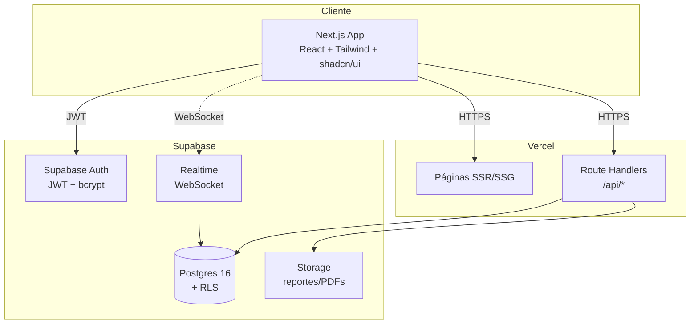
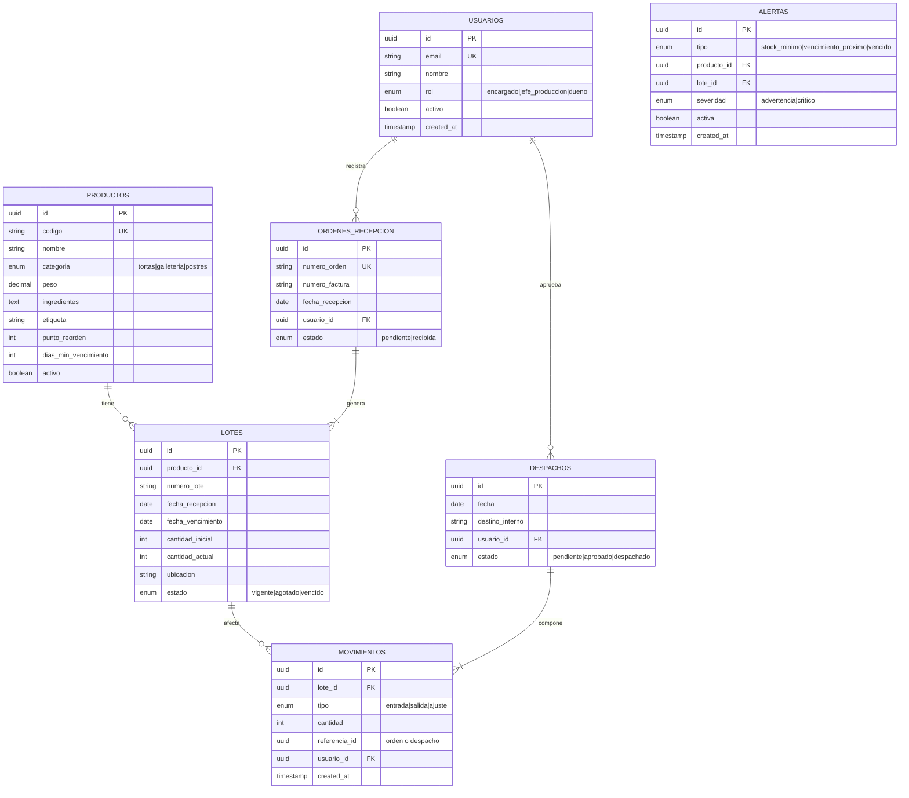
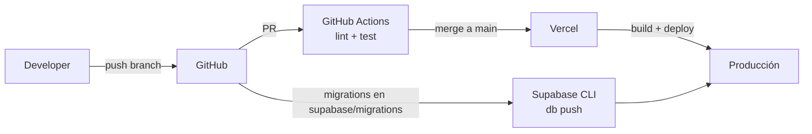

# Sistema de Gestión de Inventario y Logística (SGIL)

**Documento Técnico y Guía de Desarrollo**
**Proyecto Nuclear 3 — Corporación Universitaria Alexander von Humboldt**
**Ingeniería de Software · Semestre I-2026**

> Este documento complementa la **Especificación de Requisitos de Software (ERS)** del SGIL. La ERS es la **fuente de verdad contractual** del proyecto; este documento describe cómo se construye la solución que la satisface (arquitectura, stack, fases, despliegue).
>
> **En caso de conflicto entre este documento y la ERS, prevalece la ERS.**

---

## Tabla de contenidos

1. [Resumen ejecutivo](#1-resumen-ejecutivo)
2. [Alcance funcional](#2-alcance-funcional)
3. [Stack tecnológico](#3-stack-tecnológico)
4. [Arquitectura del sistema](#4-arquitectura-del-sistema)
5. [Modelo de datos](#5-modelo-de-datos)
6. [Seguridad y control de acceso](#6-seguridad-y-control-de-acceso)
7. [Tiempo real](#7-tiempo-real)
8. [Plan de desarrollo por cortes](#8-plan-de-desarrollo-por-cortes)
9. [Estrategia de pruebas](#9-estrategia-de-pruebas)
10. [Despliegue](#10-despliegue)
11. [Observabilidad y operación](#11-observabilidad-y-operación)
12. [Riesgos y mitigaciones](#12-riesgos-y-mitigaciones)
13. [Pendientes con Ingeniería Industrial](#13-pendientes-con-ingeniería-industrial)

---

## 1. Resumen ejecutivo

El SGIL es una aplicación web que digitaliza la gestión de inventario, recepción de mercancía, despacho interno y generación de indicadores para un centro de distribución de productos de pastelería en el Quindío.

**Objetivos del sistema:**

- Reemplazar los procesos manuales de inventario por un registro digital trazable.
- Controlar stock por **lote** con política **FEFO** (First Expired, First Out).
- Generar alertas automáticas de stock mínimo y vencimiento próximo.
- Ofrecer un dashboard de KPIs operativos y exportación de reportes.

**Decisión técnica consolidada:** la solución se construye como una app web full-stack con **Next.js 15 + TypeScript** en el frontend, **Supabase** (Postgres + Auth + Realtime + RLS) como backend-as-a-service, y despliegue en **Vercel + Supabase Cloud**.

---

## 2. Alcance funcional

### 2.1 Incluido en el MVP

| Módulo | Cubre |
|---|---|
| Autenticación | Login con email/contraseña, JWT, control por rol (RF-01, RF-02, RF-03) |
| Productos | Catálogo de productos con categoría y punto de reorden (RF-04 a RF-07) |
| Lotes | Trazabilidad por lote con fecha de vencimiento y ubicación (RF-08, RF-09) |
| Recepción | Registro de órdenes de recepción de mercancía (RF-10, RF-11) |
| Despacho interno | Salida de productos a producción con FEFO automático (RF-12, RF-13) |
| Alertas | Stock mínimo y vencimiento próximo en tiempo real (RF-14 a RF-16) |
| Indicadores | Dashboard KPI y exportación Excel/PDF (RF-17, RF-18) |

### 2.2 Fuera de alcance

- Punto de venta y despacho a clientes externos.
- Gestión de proveedores como entidad.
- Nómina, contabilidad y procesos productivos.
- Aplicación móvil nativa.

### 2.3 Roles del sistema

| Rol | Permisos |
|---|---|
| Encargado de Inventarios | Acceso completo: crear, editar, aprobar, consultar, reportar |
| Jefe de Producción | Acceso completo: crear, editar, consultar, reportar |
| Dueños | Solo lectura: consulta de inventario, dashboard y reportes |

---

## 3. Stack tecnológico

### 3.1 Decisión de stack

| Capa | Tecnología | Razón |
|---|---|---|
| Frontend | Next.js 15 (App Router) + TypeScript | SSR, rutas API integradas, tipado estricto |
| UI | Tailwind CSS + shadcn/ui | Componentes accesibles, sin dependencia de design system pesado |
| Estado servidor | TanStack Query | Cache, revalidación y sincronización con Supabase |
| Backend | Supabase (Postgres 16) | BD relacional gestionada + Auth + Realtime + RLS de fábrica |
| Auth | Supabase Auth (JWT) | Cumple RF-01, RF-02, RF-03 sin código adicional |
| Tiempo real | Supabase Realtime (Postgres Changes) | WebSockets sobre cambios de tabla, sin servidor propio |
| Validación | Zod | Esquemas compartidos cliente/servidor |
| Reportes | ExcelJS + jsPDF | Generación Excel editable (RF-18) y PDF |
| Pruebas | Vitest + Playwright | Unitarias + e2e (cubre RNF-06 cobertura ≥ 70%) |
| CI/CD | GitHub Actions + Vercel | Despliegue automático en push a `main` |

### 3.2 Justificación del cambio respecto al documento original

El documento `PROYECTO_NUCLEAR_V` proponía **Rust + Axum + SQLx + Docker + Nginx + VPS**. Se reemplaza por **Next.js + Supabase** por las siguientes razones:

- **Velocidad de desarrollo:** el plazo académico (21 abril – 26 junio 2026) son ~9 semanas para tres cortes. Rust tiene curva de aprendizaje y verbosidad que penalizan el MVP.
- **Realtime nativo:** Supabase Realtime entrega lo que el doc original llama "WebSockets para cambios de stock y alertas" sin escribir un servidor WS propio.
- **RLS = control por rol:** Postgres Row Level Security implementa **RF-02** (control de acceso por rol) a nivel de base de datos. Más seguro que validar solo en backend.
- **Postgres se conserva:** la ERS exige base relacional. Supabase ES Postgres; no hay degradación.
- **Despliegue trivial:** Vercel + Supabase eliminan Docker, Docker Compose y Nginx del camino crítico. Esto deja más tiempo para pruebas (RNF-06).
- **Migración futura:** si en el futuro se requiere salir de Supabase, la BD es Postgres estándar y se puede exportar; el frontend Next.js se despliega en cualquier proveedor.

**Trade-off aceptado:** dependencia de un proveedor (Supabase). Mitigación: el esquema SQL y las migraciones se mantienen versionados en el repositorio.

---

## 4. Arquitectura del sistema

### 4.1 Visión general



### 4.2 Capas

| Capa | Responsabilidad | Ubicación |
|---|---|---|
| Presentación | UI, formularios, dashboard, navegación | `app/(routes)/`, `components/` |
| Aplicación | Casos de uso, orquestación, validación Zod | `lib/services/`, `app/api/` |
| Dominio | Reglas de negocio (FEFO, alertas, validaciones, punto de reorden y vencimiento) | `lib/domain/` |
| Infraestructura | Cliente Supabase, repositorios, logging | `lib/supabase/`, `lib/repositories/` |

### 4.3 Estructura de carpetas propuesta

```
sgil/
├── app/
│   ├── (auth)/login/
│   ├── (dashboard)/
│   │   ├── inventario/
│   │   ├── lotes/
│   │   ├── recepcion/
│   │   ├── despachos/
│   │   ├── alertas/
│   │   └── reportes/
│   └── api/
│       ├── reportes/excel/
│       └── reportes/pdf/
├── components/
│   ├── ui/              # shadcn/ui
│   └── dominio/         # tabla productos, panel alertas, etc.
├── lib/
│   ├── domain/          # reglas FEFO, cálculo alertas, punto de reorden y vencimiento
│   ├── services/        # casos de uso
│   ├── repositories/    # acceso a Supabase
│   ├── supabase/        # cliente server/browser
│   └── schemas/         # esquemas Zod
├── supabase/
│   ├── migrations/      # SQL versionado
│   └── seed.sql
└── tests/
    ├── unit/
    └── e2e/
```

---

## 5. Modelo de datos

### 5.1 Diagrama entidad-relación



### 5.2 Reglas de negocio críticas

1. **FEFO en despachos y visualización:** al aprobar un despacho, el sistema descuenta de los lotes con `fecha_vencimiento` más cercana primero (RF-12). La consulta de lotes también usa FEFO para ordenar visualmente los lotes por vencimiento próximo (RF-09).
2. **Stock por producto = suma de `cantidad_actual` de lotes activos.**
3. **Stock nunca negativo:** una transacción de despacho que dejaría stock negativo se aborta.
4. **Punto de reorden:** cuando `stock_total <= punto_reorden`, se genera/mantiene una alerta activa (RF-14). Solo una alerta activa por producto.
5. **Vencimiento próximo:** lotes con `fecha_vencimiento - now() <= 30 días` generan alerta (RF-15).
6. **Trazabilidad:** todo cambio de stock crea un registro en `movimientos` con usuario y timestamp.
7. **Inmutabilidad del código:** `productos.codigo` no se puede modificar tras creación (RF-06).

### 5.3 Consistencia transaccional

Operaciones que tocan stock (recepción, despacho, ajuste) se ejecutan dentro de una **función Postgres (`PL/pgSQL`)** envuelta en transacción. Esto garantiza:

- Atomicidad: o se aplica todo el movimiento, o nada.
- Concurrencia segura: bloqueos a nivel de fila previenen race conditions.

---

## 6. Seguridad y control de acceso

### 6.1 Autenticación (RF-01)

- Supabase Auth con email + contraseña.
- Contraseñas hasheadas con **bcrypt** (cumple RNF-03).
- JWT con expiración de **8 horas** (configurable en Supabase Dashboard).
- HTTPS obligatorio en todas las rutas (Vercel lo provee por defecto).

### 6.2 Autorización (RF-02)

El control de rol se aplica en **tres capas**:

1. **UI:** se ocultan botones de edición para rol `dueno`.
2. **Route Handlers (`/api/*`):** middleware valida JWT y rol antes de cualquier mutación.
3. **Postgres RLS:** políticas a nivel de tabla. Ejemplo:

```sql
-- Solo encargado y jefe_produccion pueden insertar productos
CREATE POLICY productos_insert ON productos
  FOR INSERT
  WITH CHECK (
    auth.jwt() ->> 'rol' IN ('encargado', 'jefe_produccion')
  );

-- Todos los roles pueden leer
CREATE POLICY productos_select ON productos
  FOR SELECT USING (true);
```

Aunque un atacante saltara el frontend y el backend, la BD rechazaría la operación. Esto es defensa en profundidad.

### 6.3 Cumplimiento Ley 1581 de 2012 (RNF-08)

- No se almacenan datos personales de clientes finales (no hay punto de venta).
- Datos de usuarios del sistema (email, nombre) requieren consentimiento al registro.
- Acuerdo de confidencialidad con la empresa cliente se firma fuera del software.
- El acceso a información operativa se restringe mediante JWT + Row Level Security (RLS), contribuyendo al cumplimiento de RNF-08 sobre confidencialidad y control de acceso.

---

## 7. Tiempo real

### 7.1 Casos de uso de Realtime

| Evento | Suscripción | Acción en UI |
|---|---|---|
| Cambio de stock por movimiento | `movimientos` INSERT | Refresca tabla de inventario |
| Nueva alerta generada | `alertas` INSERT | Notificación toast + actualiza panel |
| Lote agotado | `lotes` UPDATE donde `cantidad_actual = 0` | Marca visual en tabla |

### 7.2 Implementación

```typescript
// Ejemplo: panel de alertas en tiempo real
const supabase = createBrowserClient();

useEffect(() => {
  const channel = supabase
    .channel('alertas')
    .on('postgres_changes',
        { event: '*', schema: 'public', table: 'alertas' },
        (payload) => refetchAlertas())
    .subscribe();

  return () => { supabase.removeChannel(channel); };
}, []);
```

La **fuente de verdad sigue siendo Postgres**. Realtime es solo un canal de notificación para refrescar la UI sin polling.

---

## 8. Plan de desarrollo por cortes

El proyecto se divide en tres cortes académicos según la matriz de trazabilidad de la ERS.

### Corte 1 — Fundación (semanas 1-3)

**Entregables:**
- Configuración de repo, Next.js, Supabase, CI/CD.
- Migraciones SQL iniciales (usuarios, productos básicos).
- Módulo de autenticación completo (RF-01, RF-02, RF-03).
- Layout base, login, dashboard vacío.
- Documentación: ERS, este documento técnico.

**Requisitos cubiertos:** RF-01, RF-02, RF-03.

### Corte 2 — Núcleo operativo (semanas 4-7)

**Entregables:**
- Módulos de productos, lotes, recepción, despacho, alertas.
- Lógica FEFO en Postgres.
- Realtime para stock y alertas.
- Pruebas unitarias del dominio (objetivo cobertura ≥ 70%).

**Requisitos cubiertos:** RF-04 a RF-16.

### Corte 3 — Indicadores y endurecimiento (semanas 8-9)

**Entregables:**
- Dashboard KPI con filtros por período (RF-17).
- Exportación Excel y PDF (RF-18).
- Pruebas e2e con Playwright.
- Despliegue productivo en Vercel + Supabase.
- Manual de usuario y documentación operativa.

**Requisitos cubiertos:** RF-17, RF-18 + todos los RNF.

---

## 9. Estrategia de pruebas

### 9.1 Pirámide de pruebas

| Nivel | Herramienta | Qué se prueba | Objetivo |
|---|---|---|---|
| Unitarias | Vitest | Lógica de dominio (FEFO, cálculo de alertas, validaciones Zod) | Cobertura ≥ 70% (RNF-06) |
| Integración | Vitest + Supabase local | Repositorios, funciones SQL, RLS | Casos críticos de stock |
| E2E | Playwright | Flujos completos: login → recepción → despacho → alerta | Happy paths por rol |

### 9.2 Casos críticos a probar

- Despacho FEFO descuenta del lote correcto.
- Despacho que supera stock disponible es rechazado.
- Alerta de stock mínimo se genera en el movimiento que cruza el umbral.
- Dueño no puede acceder a endpoints de mutación (HTTP 403).
- Token expirado obliga a nuevo login.

---

## 10. Despliegue

### 10.1 Entornos

| Entorno | Frontend | Base de datos |
|---|---|---|
| Desarrollo | `localhost:5175` | Supabase local (Docker) |
| Staging | Vercel preview | Proyecto Supabase staging |
| Producción | Vercel production | Proyecto Supabase production |

### 10.2 Flujo de despliegue



### 10.3 Variables de entorno

```
NEXT_PUBLIC_SUPABASE_URL=
NEXT_PUBLIC_SUPABASE_ANON_KEY=
SUPABASE_SERVICE_ROLE_KEY=   # solo en server, nunca expuesta al cliente
```

### 10.4 Migraciones

Toda alteración de esquema se hace mediante archivos SQL versionados en `supabase/migrations/`. No se editan tablas desde el dashboard de Supabase en producción.

```bash
supabase migration new add_punto_reorden
supabase db push
```

---

## 11. Observabilidad y operación

| Aspecto | Solución |
|---|---|
| Logs de aplicación | Vercel Logs (consola) + `console.error` estructurado |
| Logs de base de datos | Supabase Dashboard → Logs |
| Errores de cliente | Captura con `try/catch` y envío a endpoint `/api/log-error` |
| Uptime | UptimeRobot apuntando a `/api/health` (cumple RNF-02) |
| Métricas | Vercel Analytics |

**Endpoint de salud:**
```typescript
// app/api/health/route.ts
export async function GET() {
  const { error } = await supabase.from('productos').select('id').limit(1);
  return Response.json({ ok: !error, ts: new Date().toISOString() });
}
```

---

## 12. Riesgos y mitigaciones

| Riesgo | Impacto | Mitigación |
|---|---|---|
| Dependencia de Supabase | Lock-in del proveedor | Esquema SQL versionado; migración a Postgres autogestionado es factible |
| Curva de aprendizaje de RLS | Bugs de permisos | Pruebas explícitas de RLS por rol; revisar políticas en pares |
| Pendientes de Ing. Industrial sin definir | Bloqueo de Corte 2 | Lista activa de pendientes (sección 13); reuniones semanales |
| Cobertura 70% en plazo ajustado | Calidad bajo presión | Escribir pruebas en paralelo, no al final del corte |
| Realtime con muchos clientes | Latencia | El alcance es 5 usuarios concurrentes (RNF-01); Realtime soporta cientos |

---

## 13. Pendientes con Ingeniería Industrial

Estos puntos vienen de la sección 6 de la ERS y bloquean parcialmente el modelado:

- [ ] Límite mínimo de días antes del vencimiento por categoría de producto (solo confirmado para harina: 3 meses).
- [ ] Unidad de medida: ¿todos los productos en unidades o hay variables (kg, L)?
- [ ] Distribución física de bodega (racks, pasillos, niveles): ¿modelarla o usar string libre en `ubicacion`?
- [ ] Criterio de stock mínimo: ¿fijo por producto o calculado dinámicamente?
- [ ] ¿El picking debe modelarse como proceso?
- [ ] Número máximo de usuarios concurrentes (se asumió 5, RNF-01).
- [ ] ¿Notificaciones por correo o solo dentro de la app?

**Acción:** resolver en reunión antes del cierre del Corte 1.

---

## Referencias

- Especificación de Requisitos de Software (ERS) del SGIL. Mayo 2026. *(documento fuente de verdad)*
- Pressman, R. S. y Maxim, B. R. (2021). *Ingeniería del software: Un enfoque práctico* (9.ª ed.). McGraw-Hill.
- IEEE Std 830-1998. *IEEE Recommended Practice for Software Requirements Specifications*.
- Documentación oficial de Next.js — https://nextjs.org/docs
- Documentación oficial de Supabase — https://supabase.com/docs
